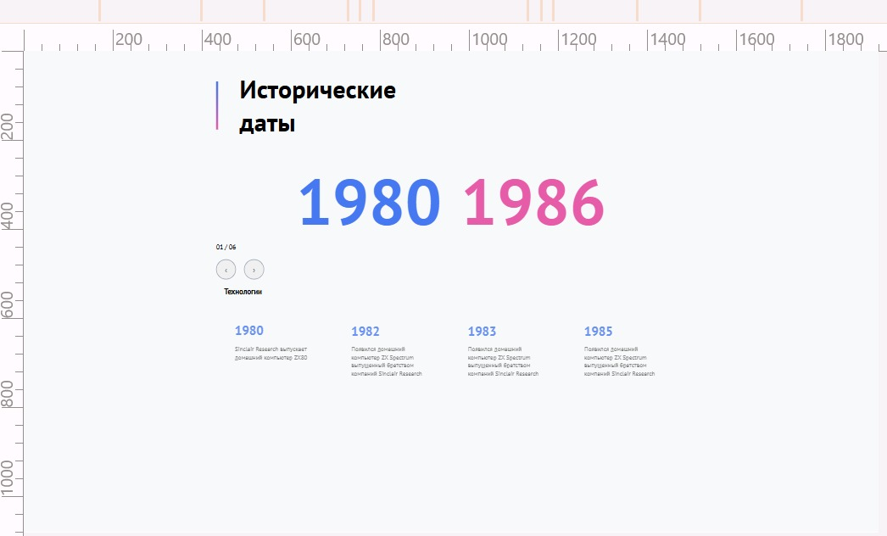
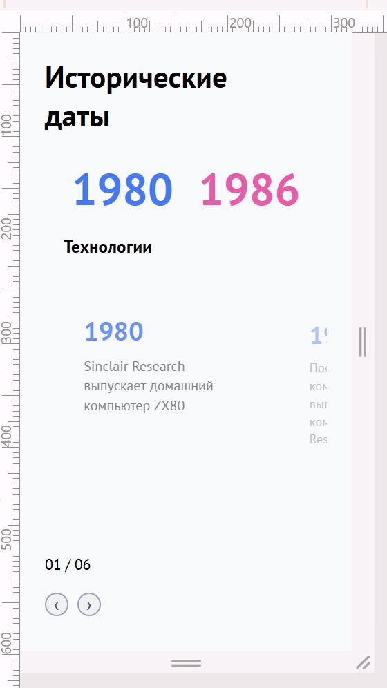

<!-- PROJECT LOGO -->
 

  
  
  <h1 align="center">History in slides</h1>

<!-- TABLE OF CONTENTS -->

  
Table of Contents

  <ol>
    <li>
      <a href="#about-the-project">About The Project</a>
      <ul>
        <li><a href="#technology-stack">Technology stack</a></li>
      </ul>
    </li>
    <li>
      <a href="#getting-started">Getting Started</a>
      <ul>
       <li><a href="#installation">Installation</a></li>
      </ul>
    </li>
  </ol>

<!-- ABOUT THE PROJECT -->

## About The Project

### _Test project_

_Completed: October 2025_

#### History in slides
Some tasks were not fullfiled because I didn't make it in time.

Task:

Описание

Реализовать следующий блок в соответствии с макетом (Файл с макетом необходимо импортировать в Figma) 

Блок содержит информацию о временных отрезках, в каждом из которых существует несколько событий. 
При переключении временных отрезков изменяются соответствующие числа и под ними показывается новый слайдер, который содержит подробную информацию по ключевым событиям на активном временном отрезке.

Возможно существование от 2 до 6 временных отрезков. Все интерактивные точки на окружности располагаются на одинаковом расстоянии друг от друга

Весь блок стоит сделать независимым от другой логики на странице. 
Например, если добавить на страницу ещё один такой же блок, верстка и логика работы этих блоков не будет нарушена

Демонстрация работы блока - пример с максимальным количеством временных отрезков

Все существующие в макете линии — это не разметочная сетка, а часть верстки 

Требования к реализации

Необходимо использовать Typescript
Можно использовать React.js или нативный JS на Ваш выбор
В случае использования нативного JS, можно воспользоваться любым удобным для Вас HTML-шаблонизатором или обычным HTML
Стилизация с использованием SASS/SCSS (В случае работы с React.js, возможно использование styled-components)
Сборка проекта с помощью Webpack
Для работы со слайдерами необходимо использовать библиотеку Swiper
Для реализации js-анимаций можно использовать библиотеку gsap

Не использовать JQuery
Не использовать Bootstrap, Tailwind и т.п.
Не использовать библиотеки с готовыми UI-компонентами такие, как MaterialUI, AntDesign и т.п.

### Technology stack

- [![NPM][NPM]][NPM-url]
- [![HTML5][HTML5]][HTML5-url]
- [![TypeScript][TypeScript]][TypeScript-url]
- [![Prettier][Prettier]][Prettier-url]
- [![Eslint][Eslint]][Eslint-url]
- [![React][React]][React-url]
  

(<a href="#readme-top">back to top</a>)

<!-- GETTING STARTED -->

## Getting Started

Please, follow these steps to run project.

### Installation

1. Clone the repo

   sh
   git clone <https://github.com/KateGoncharik/eCommerce-Application-Q4.git>

2. Install NPM packages

   sh
   npm install

3. Start project

   sh
   npm run dev

(<a href="#readme-top">back to top</a>)

[NPM]: https://img.shields.io/badge/NPM-%23CB3837.svg?style=for-the-badge&logo=npm&logoColor=white
[NPM-url]: https://www.npmjs.com
[HTML5]: https://img.shields.io/badge/html5-%23E34F26.svg?style=for-the-badge&logo=html5&logoColor=white
[HTML5-url]: https://html.com/html5/
[TypeScript]: https://img.shields.io/badge/typescript-%23007ACC.svg?style=for-the-badge&logo=typescript&logoColor=white
[TypeScript-url]: https://www.typescriptlang.org
[React]: https://img.shields.io/badge/React-20232A?style=for-the-badge&logo=react&logoColor=61DAFB
[React-url]: https://https://react.dev/
[Eslint]: https://img.shields.io/badge/eslint-3A33D1?style=for-the-badge&logo=eslint&logoColor=white
[Eslint-url]: https://eslint.org/
[Prettier]: https://img.shields.io/badge/prettier-1A2C34?style=for-the-badge&logo=prettier&logoColor=F7BA3E
[Prettier-url]: https://prettier.io/
